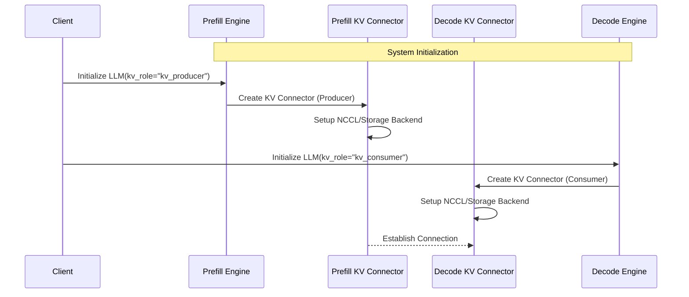
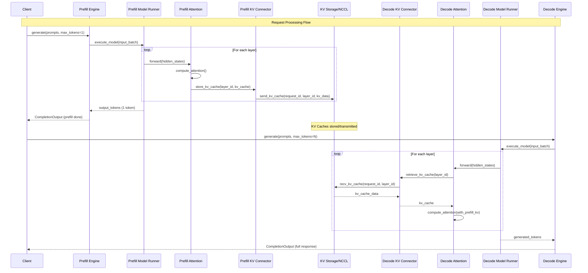
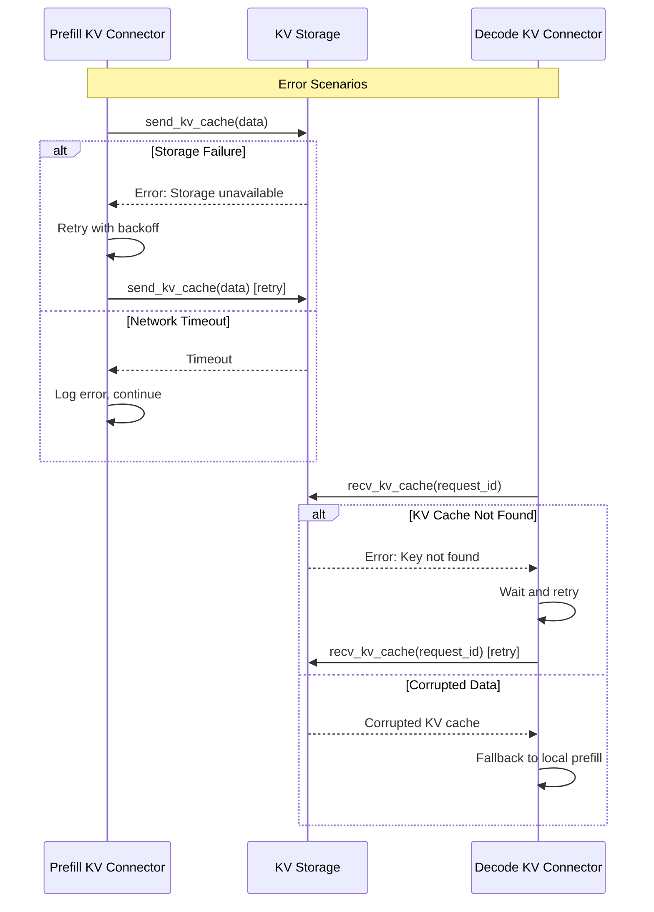

# KV Connector Call Flow Diagram

## High-Level Architecture

```
┌─────────────────────────────────┐         ┌─────────────────────────────────┐
│        Prefill Instance         │         │        Decode Instance          │
│            (GPU 0)              │         │            (GPU 1)              │
├─────────────────────────────────┤         ├─────────────────────────────────┤
│                                 │         │                                 │
│  ┌─────────────────────────────┐│         │┌─────────────────────────────────┐│
│  │        LLM Engine           ││         ││        LLM Engine               ││
│  │                             ││         ││                                 ││
│  │ ┌─────────────────────────┐ ││         ││ ┌─────────────────────────┐     ││
│  │ │    Model Runner         │ ││         ││ │    Model Runner         │     ││
│  │ │                         │ ││         ││ │                         │     ││
│  │ │ ┌─────────────────────┐ │ ││         ││ │ ┌─────────────────────┐ │     ││
│  │ │ │   Attention Layer   │ │ ││         ││ │ │   Attention Layer   │ │     ││
│  │ │ │                     │ │ ││         ││ │ │                     │ │     ││
│  │ │ │ ┌─────────────────┐ │ │ ││         ││ │ │ ┌─────────────────┐ │ │     ││
│  │ │ │ │   KV Connector  │ │ │ ││ ◄─────► ││ │ │ │   KV Connector  │ │ │     ││
│  │ │ │ │   (Producer)    │ │ │ ││         ││ │ │ │   (Consumer)    │ │ │     ││
│  │ │ │ └─────────────────┘ │ │ ││         ││ │ │ └─────────────────┘ │ │     ││
│  │ │ └─────────────────────┘ │ ││         ││ │ └─────────────────────┘ │     ││
│  │ └─────────────────────────┘ ││         ││ └─────────────────────────┘     ││
│  └─────────────────────────────┘│         │└─────────────────────────────────┘│
└─────────────────────────────────┘         └─────────────────────────────────┘
```

## Detailed Call Flow Sequence

### Phase 1: Initialization



### Phase 2: Request Processing



## Layer-by-Layer KV Transfer Detail

```
Prefill Instance (GPU 0)                    Decode Instance (GPU 1)
┌─────────────────────┐                     ┌─────────────────────┐
│                     │                     │                     │
│  Input Embeddings   │                     │  Input Embeddings   │
│         ↓           │                     │         ↓           │
│ ┌─────────────────┐ │                     │ ┌─────────────────┐ │
│ │   Layer 0       │ │ ── KV Cache ──────► │ │   Layer 0       │ │
│ │ ┌─────────────┐ │ │    Transfer         │ │ ┌─────────────┐ │ │
│ │ │ Attention   │ │ │                     │ │ │ Attention   │ │ │
│ │ │ + KV Store  │ │ │                     │ │ │ + KV Load   │ │ │
│ │ └─────────────┘ │ │                     │ │ └─────────────┘ │ │
│ └─────────────────┘ │                     │ └─────────────────┘ │
│         ↓           │                     │         ↓           │
│ ┌─────────────────┐ │                     │ ┌─────────────────┐ │
│ │   Layer 1       │ │ ── KV Cache ──────► │ │   Layer 1       │ │
│ │ ┌─────────────┐ │ │    Transfer         │ │ ┌─────────────┐ │ │
│ │ │ Attention   │ │ │                     │ │ │ Attention   │ │ │
│ │ │ + KV Store  │ │ │                     │ │ │ + KV Load   │ │ │
│ │ └─────────────┘ │ │                     │ │ └─────────────┘ │ │
│ └─────────────────┘ │                     │ └─────────────────┘ │
│         ↓           │                     │         ↓           │
│       ...           │        ...          │       ...           │
│         ↓           │                     │         ↓           │
│ ┌─────────────────┐ │                     │ ┌─────────────────┐ │
│ │   Layer N       │ │ ── KV Cache ──────► │ │   Layer N       │ │
│ │ ┌─────────────┐ │ │    Transfer         │ │ ┌─────────────┐ │ │
│ │ │ Attention   │ │ │                     │ │ │ Attention   │ │ │
│ │ │ + KV Store  │ │ │                     │ │ │ + KV Load   │ │ │
│ │ └─────────────┘ │ │                     │ │ └─────────────┘ │ │
│ └─────────────────┘ │                     │ └─────────────────┘ │
│         ↓           │                     │         ↓           │
│    LM Head          │                     │    LM Head          │
│ (1 token output)    │                     │ (N tokens output)   │
└─────────────────────┘                     └─────────────────────┘
```

## KV Connector Internal Flow

### Producer (Prefill Instance)
```
┌─────────────────────────────────────────────────────────────┐
│                    KV Connector (Producer)                  │
├─────────────────────────────────────────────────────────────┤
│                                                             │
│  store_kv_cache(request_id, layer_id, kv_cache)           │
│         ↓                                                   │
│  ┌─────────────────────────────────────────────────────┐   │
│  │              LookupBuffer                           │   │
│  │   insert(key=(req_id,layer_id), value=kv_cache)   │   │
│  └─────────────────────────────────────────────────────┘   │
│         ↓                                                   │
│  ┌─────────────────────────────────────────────────────┐   │
│  │                 Pipe                                │   │
│  │         send_tensor(kv_cache_data)                  │   │
│  └─────────────────────────────────────────────────────┘   │
│         ↓                                                   │
│  ┌─────────────────────────────────────────────────────┐   │
│  │            Backend (NCCL/Storage)                   │   │
│  │    - PyNcclConnector: nccl.send()                  │   │
│  │    - SharedStorage: write_to_disk()                │   │
│  │    - LMCache: lmcache.put()                        │   │
│  └─────────────────────────────────────────────────────┘   │
└─────────────────────────────────────────────────────────────┘
```

### Consumer (Decode Instance)  
```
┌─────────────────────────────────────────────────────────────┐
│                   KV Connector (Consumer)                   │
├─────────────────────────────────────────────────────────────┤
│                                                             │
│  retrieve_kv_cache(request_id, layer_id)                   │
│         ↓                                                   │
│  ┌─────────────────────────────────────────────────────┐   │
│  │              LookupBuffer                           │   │
│  │  drop_select(key=(req_id,layer_id)) → kv_cache    │   │
│  │                (blocking call)                      │   │
│  └─────────────────────────────────────────────────────┘   │
│         ↓ (if not found locally)                           │
│  ┌─────────────────────────────────────────────────────┐   │
│  │                 Pipe                                │   │
│  │        recv_tensor() → kv_cache_data                │   │
│  └─────────────────────────────────────────────────────┘   │
│         ↓                                                   │
│  ┌─────────────────────────────────────────────────────┐   │
│  │            Backend (NCCL/Storage)                   │   │
│  │    - PyNcclConnector: nccl.recv()                  │   │
│  │    - SharedStorage: read_from_disk()               │   │
│  │    - LMCache: lmcache.get()                        │   │
│  └─────────────────────────────────────────────────────┘   │
│         ↓                                                   │
│  Return kv_cache to attention layer                        │
└─────────────────────────────────────────────────────────────┘
```

## Timeline View

```
Timeline:  0ms    100ms   200ms   300ms   400ms   500ms   600ms
          ├───────┼───────┼───────┼───────┼───────┼───────┼───────→
          
Prefill:  │████████████│                                        
Instance  │  Prefill    │                                        
          │  Process    │                                        
          │     +       │                                        
          │ KV Transfer │                                        
          
Decode:   │             │████████████████████████████████████│  
Instance  │   Waiting   │         Decode Process              │  
          │  for KVs    │      (using transferred KVs)       │  
          
KV        │      ████████                                      │
Transfer: │    Transfer │                                      │
          │   Complete  │                                      │

Result:   │             │ Prefill KVs + Full Token Generation │
          │    1 token  │           (N tokens)                │
```

## Error Handling Flow



## Performance Considerations

### Memory Usage Pattern
```
GPU Memory Usage Over Time:

Prefill Instance (GPU 0):
Memory │
Usage  │     ┌─────┐
       │    ╱       ╲
       │   ╱         ╲ 
       │  ╱           ╲
       │ ╱             ╲____
       │╱                   ╲____
       └────────────────────────────→ Time
        Prefill    KV      Idle
        Process   Transfer

Decode Instance (GPU 1):  
Memory │                    ┌─────────┐
Usage  │                   ╱         │
       │                  ╱          │
       │                 ╱           │
       │  ┌─────────────╱            │
       │ ╱                           ╲
       │╱                             ╲___
       └────────────────────────────────────→ Time
        Wait for   KV Load   Decode Process
        KV Cache              
```

### Connector Performance Comparison
```
Throughput & Latency by Connector Type:

PyNcclConnector:     [████████████████████] High Throughput
                     [████████] Low Latency

SharedStorage:       [████████] Medium Throughput  
                     [████████████] Medium Latency

LMCacheConnectorV1:  [██████████████] High Throughput
                     [██████] Low Latency

NixlConnector:       [████████████████] High Throughput
                     [████] Very Low Latency

MultiConnector:      [████████████] Variable (depends on combination)
                     [██████████] Variable Latency
```

This comprehensive call flow diagram shows how KV connectors orchestrate the transfer of attention key-value caches between prefill and decode instances, enabling efficient disaggregated inference in vLLM.