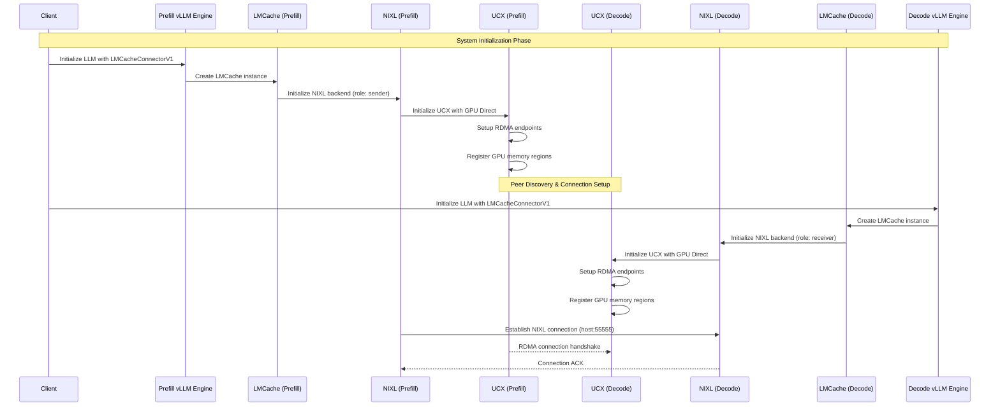
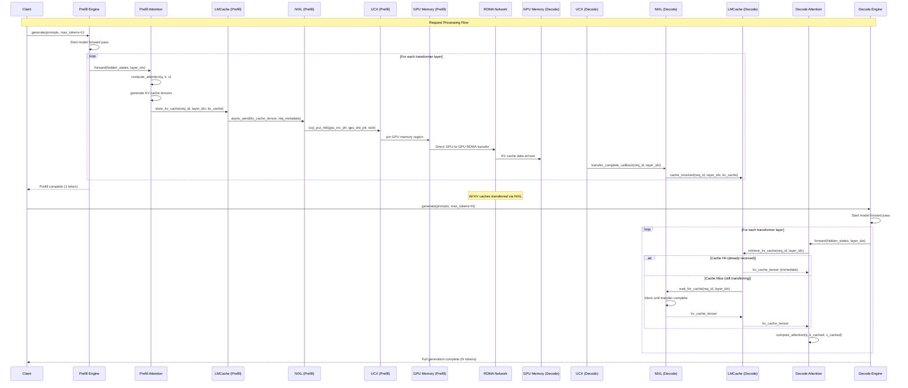
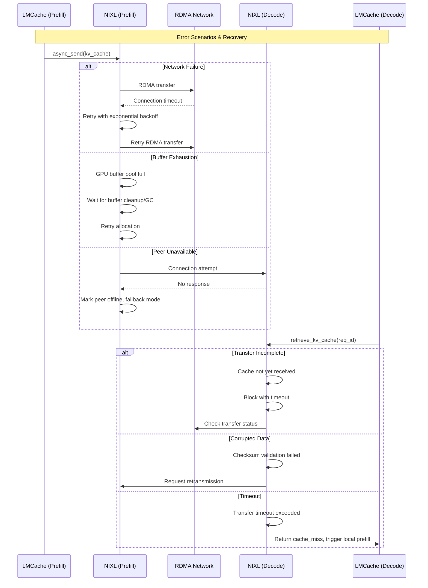

# LMCache + NIXL Call Flow Diagram

## System Architecture Overview

```
┌─────────────────────────────────┐         ┌─────────────────────────────────┐
│        Prefill Instance         │  NIXL   │        Decode Instance          │
│          (GPU 0)                │ Transfer│          (GPU 1)                │
├─────────────────────────────────┤ ◄─────► ├─────────────────────────────────┤
│                                 │         │                                 │
│ ┌─────────────────────────────┐ │         │ ┌─────────────────────────────┐ │
│ │        vLLM Engine          │ │         │ │        vLLM Engine          │ │
│ │                             │ │         │ │                             │ │
│ │ ┌─────────────────────────┐ │ │         │ │ ┌─────────────────────────┐ │ │
│ │ │     LMCacheConnectorV1  │ │ │         │ │ │     LMCacheConnectorV1  │ │ │
│ │ │                         │ │ │         │ │ │                         │ │ │
│ │ │ ┌─────────────────────┐ │ │ │         │ │ │ ┌─────────────────────┐ │ │ │
│ │ │ │      LMCache        │ │ │ │         │ │ │ │      LMCache        │ │ │ │
│ │ │ │                     │ │ │ │         │ │ │ │                     │ │ │ │
│ │ │ │ ┌─────────────────┐ │ │ │ │         │ │ │ │ ┌─────────────────┐ │ │ │ │
│ │ │ │ │  NIXL Backend   │ │ │ │ │ ◄─────► │ │ │ │ │  NIXL Backend   │ │ │ │ │
│ │ │ │ │   (Sender)      │ │ │ │ │         │ │ │ │ │  (Receiver)     │ │ │ │ │
│ │ │ │ └─────────────────┘ │ │ │ │         │ │ │ │ └─────────────────┘ │ │ │ │
│ │ │ └─────────────────────┘ │ │ │         │ │ │ └─────────────────────┘ │ │ │
│ │ └─────────────────────────┘ │ │         │ │ └─────────────────────────┘ │ │
│ └─────────────────────────────┘ │         │ └─────────────────────────────┘ │
└─────────────────────────────────┘         └─────────────────────────────────┘
            │                                           │
            ▼                                           ▼
┌─────────────────────────────────┐         ┌─────────────────────────────────┐
│         NIXL Stack              │         │         NIXL Stack              │
│                                 │         │                                 │
│ ┌─────────────────────────────┐ │         │ ┌─────────────────────────────┐ │
│ │         NIXL API            │ │         │ │         NIXL API            │ │
│ └─────────────────────────────┘ │         │ └─────────────────────────────┘ │
│ ┌─────────────────────────────┐ │         │ ┌─────────────────────────────┐ │
│ │           UCX               │ │  RDMA   │ │           UCX               │ │
│ └─────────────────────────────┘ │ ◄─────► │ └─────────────────────────────┘ │
│ ┌─────────────────────────────┐ │         │ ┌─────────────────────────────┐ │
│ │     GPU Direct/CUDA         │ │         │ │     GPU Direct/CUDA         │ │
│ └─────────────────────────────┘ │         │ └─────────────────────────────┘ │
└─────────────────────────────────┘         └─────────────────────────────────┘
```

## Detailed Call Flow Sequence

### Phase 1: System Initialization



### Phase 2: Request Processing with KV Cache Transfer



## Layer-by-Layer KV Transfer Detail

```
Prefill Instance (GPU 0)                           Decode Instance (GPU 1)
┌─────────────────────────┐                       ┌─────────────────────────┐
│                         │     NIXL Transfer     │                         │
│  ┌─────────────────┐    │     (Layer 0 KV)      │    ┌─────────────────┐  │
│  │   Attention L0  │    │ ◄──────────────────── │    │   Attention L0  │  │
│  │   KV: [B,H,S,D] │◄───┤                       │    │   KV: [B,H,S,D] │  │
│  └─────────────────┘    │                       │    └─────────────────┘  │
│           ↓              │                       │             ↓           │
│  ┌─────────────────┐    │     NIXL Transfer     │    ┌─────────────────┐  │
│  │   Attention L1  │    │     (Layer 1 KV)      │    │   Attention L1  │  │
│  │   KV: [B,H,S,D] │◄───┤ ◄──────────────────── │    │   KV: [B,H,S,D] │  │
│  └─────────────────┘    │                       │    └─────────────────┘  │
│           ↓              │                       │             ↓           │
│         ...              │         ...           │           ...           │
│           ↓              │                       │             ↓           │
│  ┌─────────────────┐    │     NIXL Transfer     │    ┌─────────────────┐  │
│  │   Attention LN  │    │     (Layer N KV)      │    │   Attention LN  │  │
│  │   KV: [B,H,S,D] │◄───┤ ◄──────────────────── │    │   KV: [B,H,S,D] │  │
│  └─────────────────┘    │                       │    └─────────────────┘  │
│           ↓              │                       │             ↓           │
│      LM Head             │                       │        LM Head          │
│    (1 token out)         │                       │     (N tokens out)      │
└─────────────────────────┘                       └─────────────────────────┘

Each layer transfers:
- K cache: [batch_size, num_heads, seq_len, head_dim]  
- V cache: [batch_size, num_heads, seq_len, head_dim]
- Metadata: request_id, layer_id, tensor shapes
- Total per layer: ~2 * B * H * S * D * sizeof(dtype) bytes
```

## NIXL Internal Transfer Flow

### Sender (Prefill Instance) Detail
```
┌─────────────────────────────────────────────────────────────┐
│                    NIXL Sender Flow                         │
├─────────────────────────────────────────────────────────────┤
│                                                             │
│  LMCache.store_kv_cache(req_id, layer_id, kv_tensor)      │
│         ↓                                                   │
│  ┌─────────────────────────────────────────────────────┐   │
│  │              NIXL Backend                           │   │
│  │                                                     │   │
│  │  1. Serialize metadata (req_id, layer_id, shape)   │   │
│  │  2. Get GPU buffer from pool (1GB allocated)       │   │
│  │  3. Copy KV tensor to NIXL buffer                  │   │
│  └─────────────────────────────────────────────────────┘   │
│         ↓                                                   │
│  ┌─────────────────────────────────────────────────────┐   │
│  │                UCX Layer                            │   │
│  │                                                     │   │
│  │  ucp_put_nbi(                                      │   │
│  │    src_ptr  = nixl_gpu_buffer,                     │   │
│  │    dst_ptr  = remote_gpu_buffer,                   │   │
│  │    size     = kv_tensor_size,                      │   │
│  │    callback = transfer_complete                     │   │
│  │  )                                                  │   │
│  └─────────────────────────────────────────────────────┘   │
│         ↓                                                   │
│  ┌─────────────────────────────────────────────────────┐   │
│  │            GPU Direct / RDMA                        │   │
│  │                                                     │   │
│  │  - Pin source GPU memory                           │   │
│  │  - Setup RDMA descriptor                           │   │
│  │  - Direct GPU-to-GPU transfer                      │   │
│  │  - No CPU involvement                              │   │
│  └─────────────────────────────────────────────────────┘   │
│         ↓                                                   │
│  Asynchronous completion → callback → buffer cleanup       │
└─────────────────────────────────────────────────────────────┘
```

### Receiver (Decode Instance) Detail
```
┌─────────────────────────────────────────────────────────────┐
│                   NIXL Receiver Flow                        │
├─────────────────────────────────────────────────────────────┤
│                                                             │
│  LMCache.retrieve_kv_cache(req_id, layer_id)              │
│         ↓                                                   │
│  ┌─────────────────────────────────────────────────────┐   │
│  │              NIXL Backend                           │   │
│  │                                                     │   │
│  │  1. Check local cache first                        │   │
│  │  2. If not found, wait for RDMA completion         │   │
│  │  3. Deserialize metadata when received             │   │
│  └─────────────────────────────────────────────────────┘   │
│         ↓                                                   │
│  ┌─────────────────────────────────────────────────────┐   │
│  │                UCX Layer                            │   │
│  │                                                     │   │
│  │  RDMA completion handler:                           │   │
│  │    1. Notification of data arrival                 │   │
│  │    2. Validate transfer integrity                  │   │
│  │    3. Signal NIXL completion                       │   │
│  └─────────────────────────────────────────────────────┘   │
│         ↓                                                   │
│  ┌─────────────────────────────────────────────────────┐   │
│  │            GPU Direct / RDMA                        │   │
│  │                                                     │   │
│  │  - Data arrives directly in GPU buffer             │   │
│  │  - No CPU memcpy required                          │   │
│  │  - Memory already in attention-ready format        │   │
│  └─────────────────────────────────────────────────────┘   │
│         ↓                                                   │
│  Return kv_tensor pointer → Attention Layer                │
└─────────────────────────────────────────────────────────────┘
```

## Configuration-Driven Connection Setup

### Prefiller Initialization
```yaml
# lmcache-prefiller-config.yaml processing
enable_nixl: True              # Enable NIXL backend
nixl_role: "sender"           # Set as KV producer
nixl_peer_host: "localhost"   # Target decode instance  
nixl_peer_port: 55555        # Communication port
nixl_buffer_size: 1073741824 # 1GB GPU buffer pool
nixl_buffer_device: "cuda"   # Use GPU memory
```

### Decoder Initialization  
```yaml
# lmcache-decoder-config.yaml processing
enable_nixl: True              # Enable NIXL backend
nixl_role: "receiver"         # Set as KV consumer
nixl_peer_host: "localhost"   # Source prefill instance
nixl_peer_port: 55555        # Communication port  
nixl_buffer_size: 1073741824 # 1GB GPU buffer pool
nixl_buffer_device: "cuda"   # Use GPU memory
```

## Error Handling and Recovery



## Performance Timeline

```
Transfer Timeline for Multi-Layer Model (32 layers):

Time:     0ms   10ms   20ms   30ms   40ms   50ms   60ms
         ├──────┼──────┼──────┼──────┼──────┼──────┼──────→

Prefill: ████████████████████████████│                    
Layer 0: ███│                        │                    
Layer 1:    ███│                     │                    
Layer 2:       ███│                  │                    
...            ...│                  │                    
Layer N:         ████│               │                    
                     │               │                    
NIXL:    ░░░░░░░░░░░░░░░░░░░░░░░░░░░░░│ (Overlapped)      
Transfer:║║║║║║║║║║║║║║║║║║║║║║║║║║║║║│                    
         ↑                           ↑                    
    Start Layer 0              All Transfers              
    Transfer                    Complete                   

Decode:                               │████████████████████
Wait:                                 │                    
Layer 0:                              │███│                
Layer 1:                              │   ███│             
...                                   │      ...│          
Layer N:                              │         ████│      

Key:
████ = Computation
░░░░ = NIXL Transfer (async)  
║║║║ = RDMA Transfer
───  = Waiting/Idle
```

## Memory Layout and Buffer Management

```
GPU Memory Layout in NIXL:

┌─────────────────────────────────────────────────────────┐
│                    GPU Memory Space                     │
├─────────────────────────────────────────────────────────┤
│                                                         │
│  ┌─────────────────┐  ┌─────────────────────────────┐   │
│  │  Model Weights  │  │     NIXL Buffer Pool        │   │
│  │  (Static)       │  │     (1GB allocated)         │   │
│  │                 │  │                             │   │
│  │  - Transformer  │  │  ┌───────────────────────┐   │   │
│  │    layers       │  │  │ Buffer 0 (256MB)      │   │   │
│  │  - Embeddings   │  │  │ - Layer 0-7 KV cache │   │   │
│  │  - LM head      │  │  └───────────────────────┘   │   │
│  └─────────────────┘  │  ┌───────────────────────┐   │   │
│                       │  │ Buffer 1 (256MB)      │   │   │
│  ┌─────────────────┐  │  │ - Layer 8-15 KV cache│   │   │
│  │ Active KV Cache │  │  └───────────────────────┘   │   │
│  │ (Current batch) │  │  ┌───────────────────────┐   │   │
│  │                 │  │  │ Buffer 2 (256MB)      │   │   │
│  │ - Key tensors   │  │  │ - Layer 16-23 KV     │   │   │
│  │ - Value tensors │  │  └───────────────────────┘   │   │
│  └─────────────────┘  │  ┌───────────────────────┐   │   │
│                       │  │ Buffer 3 (256MB)      │   │   │
│  ┌─────────────────┐  │  │ - Layer 24-31 KV     │   │   │
│  │ Workspace       │  │  └───────────────────────┘   │   │
│  │ (Activations)   │  └─────────────────────────────┘   │
│  └─────────────────┘                                    │
└─────────────────────────────────────────────────────────┘

Buffer Management:
- Ring buffer allocation for continuous transfer
- Garbage collection when buffers freed
- Direct pointer sharing (zero-copy within GPU)
- Memory-mapped RDMA regions for cross-GPU access
```

This comprehensive call flow shows how LMCache and NIXL work together to provide ultra-high-performance KV cache transfer between disaggregated vLLM instances, leveraging direct GPU-to-GPU RDMA for minimal latency and maximum throughput.