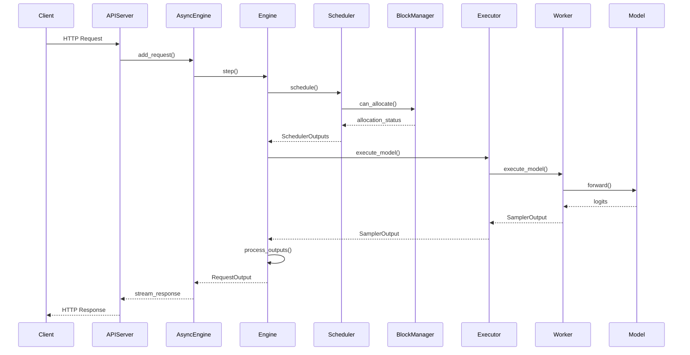
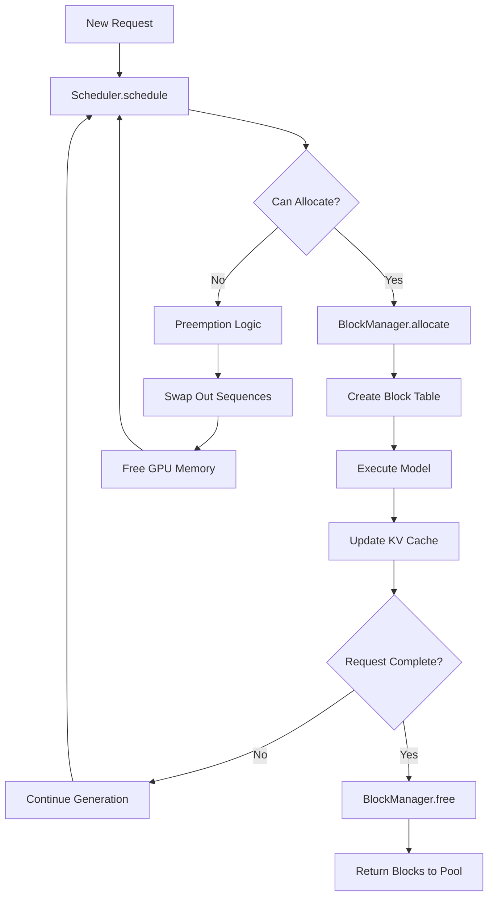

# vLLM Call Flow: Component and Module Interactions

This document provides a detailed analysis of the call flow and component interactions inside vLLM, tracing the complete execution path from incoming request to final response.

## Overview of Call Flow Architecture

vLLM follows a layered architecture with clear separation of concerns:

1. **Entry Points** → Handle incoming requests
2. **Engine Layer** → Orchestrates execution 
3. **Scheduling Layer** → Manages request batching and memory
4. **Execution Layer** → Runs the model
5. **Hardware Layer** → Executes on GPU/CPU/TPU

## Complete Request Call Flow

### Phase 1: Request Ingestion and Setup

```python
# Entry Point: API Server or Python SDK
@app.post("/v1/completions")
async def create_completion(request: CompletionRequest):
    # 1. REQUEST VALIDATION
    validated_request = await validate_request(request)
    
    # 2. CALL ENGINE
    request_id = random_uuid()
    results_generator = engine.generate(
        prompt=validated_request.prompt,
        sampling_params=validated_request.to_sampling_params(),
        request_id=request_id
    )
    
    # 3. STREAM OR RETURN RESULTS
    async for result in results_generator:
        yield result
```

**Component Interaction Flow:**
```
OpenAI API Server (entrypoints/openai/api_server.py)
    ↓ validate_request()
    ↓ create sampling_params
AsyncLLMEngine (engine/async_llm_engine.py)
    ↓ add_request()
    ↓ create sequence_group
LLMEngine (engine/llm_engine.py)
    ↓ step() - main engine loop
```

### Phase 2: Engine Orchestration

```python
# vllm/engine/llm_engine.py
class LLMEngine:
    def step(self) -> List[RequestOutput]:
        """Main engine execution loop"""
        
        # STEP 1: SCHEDULING
        seq_group_metadata_list, scheduler_outputs = self.scheduler.schedule()
        
        if scheduler_outputs.is_empty():
            return []
            
        # STEP 2: EXECUTION 
        execute_model_req = ExecuteModelRequest(
            seq_group_metadata_list=seq_group_metadata_list,
            blocks_to_swap_in=scheduler_outputs.blocks_to_swap_in,
            blocks_to_swap_out=scheduler_outputs.blocks_to_swap_out,
            blocks_to_copy=scheduler_outputs.blocks_to_copy,
        )
        
        output = self.model_executor.execute_model(execute_model_req)
        
        # STEP 3: OUTPUT PROCESSING
        return self._process_model_outputs(output, scheduler_outputs)
```

**Detailed Component Calls:**
```
LLMEngine.step()
    ├── Scheduler.schedule()
    │   ├── _schedule_prefill()
    │   ├── _schedule_decode()  
    │   ├── _preempt_requests()
    │   └── return SchedulerOutputs
    │
    ├── ModelExecutor.execute_model()
    │   ├── Worker.execute_model()
    │   ├── ModelRunner.forward()
    │   └── ModelRunner.sample()
    │
    └── _process_model_outputs()
        ├── _update_sequences()
        ├── _free_finished_seq_groups()
        └── return RequestOutput[]
```

### Phase 3: Scheduling and Memory Management

```python
# vllm/core/scheduler.py
class Scheduler:
    def schedule(self) -> Tuple[List[SequenceGroupMetadata], SchedulerOutputs]:
        """Core scheduling algorithm"""
        
        # STEP 1: MEMORY MANAGEMENT
        self._free_finished_seq_groups()
        
        # STEP 2: PREEMPTION HANDLING
        self._handle_preemptions()
        
        # STEP 3: SELECT PREFILL REQUESTS
        prefills = self._schedule_prefill()
        
        # STEP 4: SELECT DECODE REQUESTS
        decodes = self._schedule_decode()
        
        # STEP 5: MEMORY OPERATIONS
        blocks_to_swap_in = self._get_swap_in_blocks()
        blocks_to_copy = self._get_copy_blocks()
        
        return self._create_scheduler_outputs(prefills + decodes)
        
    def _schedule_prefill(self):
        """Schedule new requests for prefill"""
        scheduled = []
        
        while self.waiting and self._can_allocate_seq_group(self.waiting[0]):
            seq_group = self.waiting.popleft()
            
            # ALLOCATE MEMORY
            self.block_manager.allocate(seq_group)
            
            # MOVE TO RUNNING
            self.running.append(seq_group)
            scheduled.append(seq_group)
            
        return scheduled
```

**Memory Management Call Flow:**
```
Scheduler.schedule()
    ├── BlockSpaceManager.can_allocate()
    │   ├── _get_num_required_blocks()
    │   └── _check_available_blocks()
    │
    ├── BlockSpaceManager.allocate()
    │   ├── _allocate_sequence_group()
    │   ├── _create_block_table()
    │   └── _update_memory_pool()
    │
    └── BlockSpaceManager.free()
        ├── _free_block_table()
        └── _return_blocks_to_pool()
```

### Phase 4: Model Execution

```python
# vllm/worker/worker.py
class Worker:
    def execute_model(self, execute_model_req) -> List[SamplerOutput]:
        """Execute model on single GPU"""
        
        # STEP 1: PREPARE MODEL INPUT
        model_input = self.prepare_model_input(execute_model_req)
        
        # STEP 2: EXECUTE FORWARD PASS
        hidden_states = self.model_runner.execute_model(
            model_input=model_input,
            kv_caches=self.gpu_cache,
        )
        
        return hidden_states

# vllm/worker/model_runner.py  
class ModelRunner:
    def execute_model(self, model_input, kv_caches) -> List[SamplerOutput]:
        """Run forward pass and sampling"""
        
        # STEP 1: PREPARE INPUTS
        input_tokens = model_input.input_tokens
        positions = model_input.input_positions
        attn_metadata = model_input.attn_metadata
        
        # STEP 2: MODEL FORWARD PASS
        logits = self.model(
            input_ids=input_tokens,
            positions=positions, 
            kv_caches=kv_caches,
            attn_metadata=attn_metadata,
        )
        
        # STEP 3: SAMPLING
        next_tokens = self.sampler(
            logits=logits,
            sampling_metadata=model_input.sampling_metadata,
        )
        
        return next_tokens
```

**Model Execution Call Stack:**
```
Worker.execute_model()
    ├── prepare_model_input()
    │   ├── _prepare_input_tokens()
    │   ├── _prepare_positions()
    │   ├── _prepare_attention_metadata()
    │   └── _prepare_sampling_metadata()
    │
    ├── ModelRunner.execute_model()
    │   ├── Model.forward()
    │   │   ├── embed_tokens()
    │   │   ├── TransformerLayer.forward() [×N layers]
    │   │   │   ├── Attention.forward()
    │   │   │   │   ├── compute_qkv()
    │   │   │   │   ├── AttentionBackend.forward()
    │   │   │   │   └── apply_rotary_embedding()
    │   │   │   └── MLP.forward()
    │   │   └── lm_head()
    │   │
    │   └── Sampler.forward()
    │       ├── apply_temperature()
    │       ├── apply_top_p_top_k()
    │       ├── apply_penalties()
    │       └── multinomial_sample()
    │
    └── return SamplerOutput[]
```

### Phase 5: Attention Computation Deep Dive

```python
# vllm/attention/layer.py
class Attention:
    def forward(self, query, key, value, kv_cache, attn_metadata):
        """Main attention computation"""
        
        # STEP 1: PREPARE Q, K, V
        query = self.q_proj(hidden_states)
        key = self.k_proj(hidden_states) 
        value = self.v_proj(hidden_states)
        
        # STEP 2: APPLY ROTARY EMBEDDINGS
        query, key = self.rotary_emb(query, key, positions)
        
        # STEP 3: UPDATE KV CACHE
        key_cache, value_cache = kv_cache
        ops.reshape_and_cache(key, value, key_cache, value_cache, slot_mapping)
        
        # STEP 4: ATTENTION COMPUTATION
        attn_output = self.attn_backend.forward(
            query=query,
            key=key_cache,
            value=value_cache, 
            attn_metadata=attn_metadata,
        )
        
        # STEP 5: OUTPUT PROJECTION
        output = self.o_proj(attn_output)
        return output
```

**Attention Backend Call Flow:**
```
Attention.forward()
    ├── compute_qkv_projections()
    ├── apply_rotary_embeddings()
    ├── reshape_and_cache_kv()
    │   └── ops.reshape_and_cache() [CUDA kernel]
    │
    ├── AttentionBackend.forward()
    │   ├── [FlashAttention] flash_attn_func()
    │   ├── [PagedAttention] paged_attention_v1/v2()
    │   ├── [XFormers] xformers.ops.memory_efficient_attention()
    │   └── [TorchNative] F.scaled_dot_product_attention()
    │
    └── apply_output_projection()
```

### Phase 6: Distributed Execution (Multi-GPU)

```python
# vllm/executor/ray_distributed_executor.py
class RayDistributedExecutor:
    def execute_model(self, execute_model_req) -> List[SamplerOutput]:
        """Coordinate execution across multiple GPUs"""
        
        # STEP 1: BROADCAST REQUEST TO ALL WORKERS
        futures = []
        for worker in self.workers:
            future = worker.execute_model.remote(execute_model_req)
            futures.append(future)
            
        # STEP 2: WAIT FOR ALL WORKERS
        outputs = ray.get(futures)
        
        # STEP 3: AGGREGATE RESULTS (if needed)
        if self.parallel_config.tensor_parallel_size > 1:
            # Results already aggregated via all-reduce in workers
            return outputs[0] 
        else:
            # Concatenate results from data parallel workers
            return self._concatenate_outputs(outputs)

# Worker communication during tensor parallelism
class TensorParallelWorker:
    def execute_model(self, execute_model_req):
        """Execute model slice on this GPU"""
        
        # STEP 1: EXECUTE LOCAL COMPUTATION
        local_output = self.model_runner.execute_model(execute_model_req)
        
        # STEP 2: ALL-REDUCE ACROSS TP GROUP
        if self.tp_size > 1:
            torch.distributed.all_reduce(
                local_output, 
                group=self.tp_group,
                op=ReduceOp.SUM
            )
        
        return local_output
```

**Distributed Execution Flow:**
```
RayDistributedExecutor.execute_model()
    ├── Broadcast to all workers
    │   ├── Worker0.execute_model.remote()
    │   ├── Worker1.execute_model.remote() 
    │   └── WorkerN.execute_model.remote()
    │
    ├── Each Worker executes:
    │   ├── ModelRunner.execute_model()
    │   ├── Model.forward() [local slice]
    │   └── torch.distributed.all_reduce()
    │
    ├── ray.get(futures) # Wait for completion
    └── return aggregated results
```

## Module Interaction Patterns

### 1. Request Processing Pipeline



### 2. Memory Management Flow



### 3. Attention Computation Flow

```python
# Detailed attention call sequence
attention_flow = {
    "phase_1_preparation": [
        "Attention.forward()",
        "├── q_proj(hidden_states)",
        "├── k_proj(hidden_states)", 
        "├── v_proj(hidden_states)",
        "└── apply_rotary_pos_emb(q, k, positions)"
    ],
    
    "phase_2_caching": [
        "reshape_and_cache_kv()",
        "├── ops.reshape_and_cache() [CUDA kernel]",
        "├── update key_cache[slot_mapping]",
        "└── update value_cache[slot_mapping]"
    ],
    
    "phase_3_attention": [
        "AttentionBackend.forward()",
        "├── prepare_attention_metadata()",
        "├── select_backend_implementation()",
        "│   ├── PagedAttention → ops.paged_attention_v1()",
        "│   ├── FlashAttention → flash_attn_func()",
        "│   └── XFormers → memory_efficient_attention()",
        "└── return attention_output"
    ],
    
    "phase_4_output": [
        "o_proj(attention_output)",
        "└── return final_output"
    ]
}
```

## Critical Code Paths

### Hot Path: Decode Step Execution

```python
# Most frequent code path during generation
decode_hot_path = [
    "1. AsyncLLMEngine.engine_step()",
    "2. LLMEngine.step()",
    "3. Scheduler._schedule_decode()",      # Select running sequences
    "4. Worker.execute_model()",
    "5. ModelRunner.execute_model()",
    "6. Model.forward()",                   # Single token forward pass
    "7. Attention.forward()",               # Read from KV cache  
    "8. ops.paged_attention_v1()",          # CUDA kernel
    "9. Sampler.forward()",                 # Sample next token
    "10. Update sequences and KV cache"
]
```

### Cold Path: New Request Prefill

```python
# Less frequent but more expensive code path
prefill_cold_path = [
    "1. APIServer.create_completion()",
    "2. AsyncLLMEngine.add_request()",
    "3. Create SequenceGroup",
    "4. Scheduler._schedule_prefill()",     # Allocate memory
    "5. BlockManager.allocate()",           # Get blocks
    "6. Worker.execute_model()",
    "7. Model.forward()",                   # Process all input tokens
    "8. Attention.forward()",               # Compute attention matrix
    "9. Generate initial KV cache",         # Store keys/values
    "10. Sampler.forward()",                # Sample first token
    "11. Move to decode phase"
]
```

### Error Handling Flow

```python
# Exception handling across layers
error_handling_flow = {
    "memory_errors": [
        "BlockManager.allocate() → OutOfMemoryError",
        "Scheduler._schedule_prefill() → Preemption", 
        "Worker.execute_model() → CUDA OOM",
        "Recovery: Free memory, retry with smaller batch"
    ],
    
    "model_errors": [
        "ModelRunner.execute_model() → ModelExecutionError",
        "Attention.forward() → AttentionError",
        "Recovery: Skip sequence, return error to client"
    ],
    
    "distributed_errors": [
        "RayDistributedExecutor → WorkerTimeoutError",
        "torch.distributed → Communication errors",
        "Recovery: Restart failed workers, resubmit requests"
    ]
}
```

## Performance Critical Sections

### 1. Memory Allocation Path
```python
# Time-critical memory operations
critical_memory_ops = [
    "BlockManager.can_allocate()",          # O(1) - check free blocks
    "BlockManager.allocate()",              # O(n) - allocate n blocks  
    "BlockManager.free()",                  # O(1) - return blocks to pool
    "Block table lookup",                   # O(1) - hash table access
]
```

### 2. Attention Computation  
```python
# GPU kernel execution - most expensive operations
attention_kernels = [
    "ops.reshape_and_cache()",              # Memory bandwidth bound
    "ops.paged_attention_v1()",             # Memory + compute bound
    "flash_attn_func()",                    # Compute optimized
    "Memory transfers: CPU ↔ GPU",          # PCIe bandwidth bound
]
```

### 3. Distributed Communication
```python  
# Network communication overhead
distributed_comm = [
    "torch.distributed.all_reduce()",       # Tensor parallel sync
    "ray.get() / ray.put()",               # Data parallel transfer
    "KV cache transfers",                   # Disaggregated prefill
    "Model weight loading",                 # Initial setup cost
]
```

## Component Dependencies

### Dependency Graph
```python
component_dependencies = {
    "LLMEngine": ["Scheduler", "ModelExecutor", "Tokenizer"],
    "Scheduler": ["BlockSpaceManager", "SequenceGroup"],
    "BlockSpaceManager": ["BlockAllocator", "BlockTable"],
    "ModelExecutor": ["Worker", "RayDistributedExecutor"],
    "Worker": ["ModelRunner", "CacheEngine"],
    "ModelRunner": ["Model", "Sampler", "AttentionBackend"],
    "Model": ["TransformerLayer", "Embedding", "LMHead"],
    "TransformerLayer": ["Attention", "MLP", "LayerNorm"],
    "Attention": ["AttentionBackend", "RotaryEmbedding"],
    "AttentionBackend": ["PagedAttention", "FlashAttention", "XFormers"]
}
```

This call flow analysis shows how vLLM's modular architecture enables efficient LLM serving through carefully orchestrated component interactions, with clear separation between scheduling, memory management, and model execution concerns.