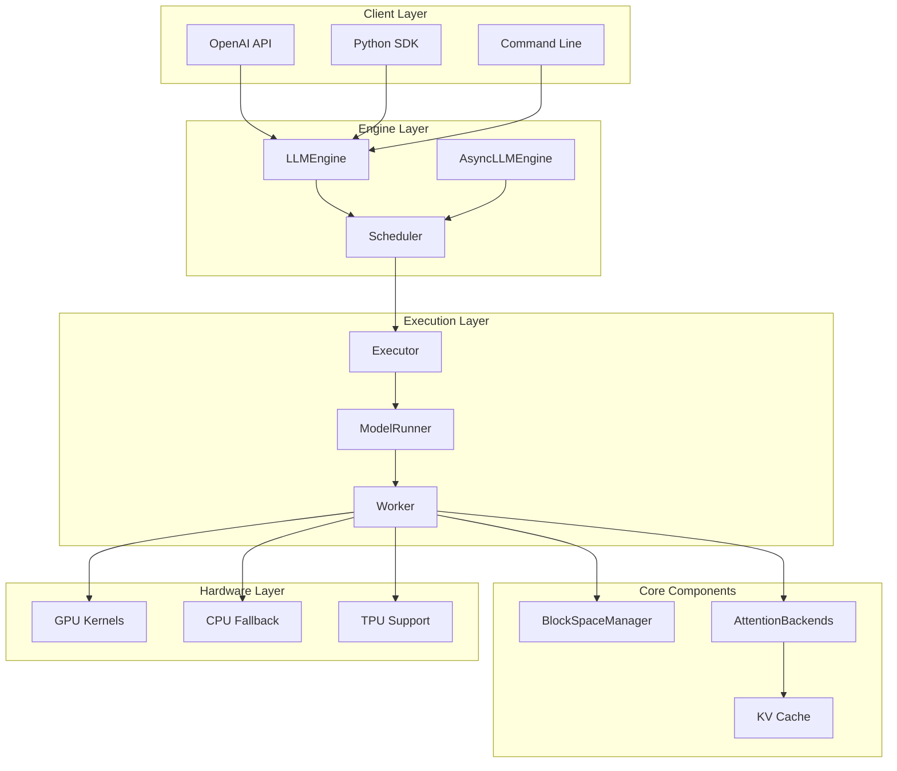

# vLLM Complete Guide: Concepts, Architecture & Implementation

This comprehensive guide covers vLLM's core concepts, architectural innovations, and implementation details to provide a complete understanding of the system.

## Table of Contents

1. [Core Concepts](#core-concepts)
2. [System Architecture](#system-architecture)
3. [Key Innovations](#key-innovations)
4. [Implementation Deep Dive](#implementation-deep-dive)
5. [Development Roadmap](#development-roadmap)
6. [Performance Characteristics](#performance-characteristics)
7. [Deployment Patterns](#deployment-patterns)

## Core Concepts

### What is vLLM?

vLLM (Very Large Language Model) is a **high-throughput, memory-efficient inference and serving engine** for Large Language Models. Originally developed at UC Berkeley's Sky Computing Lab, it has become the industry standard for LLM serving.

**Key Value Propositions:**
- **High Throughput**: Serve more requests with the same hardware
- **Memory Efficiency**: Optimal GPU memory utilization  
- **Low Latency**: Fast response times for interactive applications
- **Easy Deployment**: Simple APIs compatible with OpenAI

### Fundamental Challenges in LLM Serving

#### 1. Memory Inefficiency Problem
```python
# Traditional approach - pre-allocate maximum memory
traditional_serving = {
    "approach": "Static memory allocation",
    "memory_usage": "Pre-allocate max_seq_len for each request",
    "efficiency": "~50% memory utilization",
    "example": "For 2048 max tokens, allocate full 2048 even for 10-token inputs"
}

# vLLM's solution - dynamic allocation
vllm_approach = {
    "approach": "Dynamic block allocation (PagedAttention)",
    "memory_usage": "Allocate blocks as needed",
    "efficiency": "~90% memory utilization", 
    "example": "For 10-token input, allocate only 1 block initially"
}
```

#### 2. Batching Complexity
```python
# Challenge: Different sequence lengths in a batch
batch_complexity = {
    "problem": "Sequences finish at different times",
    "traditional_solution": "Wait for entire batch to complete",
    "inefficiency": "GPU idle time when some sequences finish early",
    "vllm_solution": "Continuous batching - add new requests as others complete"
}
```

#### 3. KV Cache Management
```python
# Memory requirements grow quadratically with context
kv_cache_challenge = {
    "memory_per_token": "2 * num_layers * hidden_size * num_heads * head_dim",
    "scaling": "Linear with sequence length, batch size",
    "example_70b_model": "~1.5GB for 2048 tokens",
    "vllm_innovation": "PagedAttention for efficient cache management"
}
```

## System Architecture

### High-Level Architecture Overview



### Component Breakdown

#### 1. Engine Layer (`vllm/engine/`)

**LLMEngine**: Core synchronous inference engine
```python
class LLMEngine:
    """Main engine for LLM inference"""
    
    def __init__(self, vllm_config):
        self.model_config = vllm_config.model_config
        self.scheduler_config = vllm_config.scheduler_config
        self.parallel_config = vllm_config.parallel_config
        
        # Initialize core components
        self.scheduler = Scheduler(...)
        self.executor = self._create_executor()
        self.tokenizer = self._init_tokenizer()
    
    def generate(self, prompts, sampling_params):
        """Main generation interface"""
        # 1. Tokenize inputs
        # 2. Create sequences  
        # 3. Schedule execution
        # 4. Run model forward pass
        # 5. Sample tokens
        # 6. Update sequences
        # 7. Return outputs
```

**AsyncLLMEngine**: Asynchronous wrapper for high-throughput serving
```python
class AsyncLLMEngine:
    """Async engine for serving applications"""
    
    async def add_request(self, prompt, sampling_params):
        """Non-blocking request submission"""
        
    async def abort_request(self, request_id):
        """Cancel ongoing requests"""
        
    async def engine_step(self):
        """Single engine iteration"""
        # Process batch of requests
        # Return completed outputs
```

#### 2. Scheduling System (`vllm/core/`)

**Scheduler**: Intelligent request batching and memory management
```python
class Scheduler:
    """Core scheduling logic"""
    
    def schedule(self) -> SchedulerOutputs:
        """Main scheduling algorithm"""
        
        # 1. Select sequences for prefill (new requests)
        prefill_seq_groups = self._schedule_prefill()
        
        # 2. Select sequences for decode (ongoing)  
        decode_seq_groups = self._schedule_decode()
        
        # 3. Handle memory pressure
        if memory_pressure:
            preempted = self._preempt_sequences()
            
        # 4. Return execution plan
        return SchedulerOutputs(
            scheduled_seq_groups=prefill_seq_groups + decode_seq_groups,
            num_prefill_groups=len(prefill_seq_groups),
            blocks_to_swap_in=swap_in_blocks,
            blocks_to_swap_out=swap_out_blocks,
            blocks_to_copy=copy_blocks,
        )
```

**BlockSpaceManager**: Memory allocation and KV cache management
```python
class BlockSpaceManager:
    """Manages GPU memory blocks for KV cache"""
    
    def __init__(self, block_size, num_gpu_blocks, num_cpu_blocks):
        self.block_size = block_size  # tokens per block (e.g., 16)
        self.gpu_allocator = BlockAllocator(num_gpu_blocks)
        self.cpu_allocator = BlockAllocator(num_cpu_blocks)
        
    def allocate(self, seq_group) -> BlockTable:
        """Allocate blocks for a sequence group"""
        
    def can_append_slots(self, seq_group, num_lookahead_slots) -> bool:
        """Check if we can allocate more tokens"""
        
    def append_slots(self, seq, num_lookahead_slots):
        """Allocate additional blocks as sequence grows"""
```

#### 3. Execution Layer (`vllm/executor/`, `vllm/worker/`)

**Executor**: Coordinates distributed execution
```python
class GPUExecutor:
    """Single-GPU executor"""
    
    def __init__(self, vllm_config):
        self.worker = Worker(vllm_config)
        
    def execute_model(self, execute_model_req) -> List[SamplerOutput]:
        """Execute model forward pass"""
        return self.worker.execute_model(execute_model_req)

class RayDistributedExecutor:
    """Multi-GPU distributed executor using Ray"""
    
    def __init__(self, vllm_config):
        # Create workers on multiple GPUs/nodes
        self.workers = [Worker.remote(...) for _ in range(num_workers)]
```

**Worker**: Executes model on individual GPU
```python
class Worker:
    """Single GPU worker"""
    
    def __init__(self, vllm_config):
        self.model_runner = ModelRunner(vllm_config)
        self.cache_engine = CacheEngine(...)
        
    def execute_model(self, execute_model_req) -> List[SamplerOutput]:
        """Execute forward pass and sampling"""
        
        # 1. Prepare inputs (InputMetadata, block tables)
        input_metadata = self._prepare_inputs(execute_model_req)
        
        # 2. Execute forward pass
        logits = self.model_runner.forward(input_metadata)
        
        # 3. Sample next tokens  
        outputs = self.model_runner.sample(logits, sampling_metadata)
        
        return outputs
```

#### 4. Model Executor (`vllm/model_executor/`)

**ModelRunner**: Coordinates model execution
```python
class ModelRunner:
    """Runs the actual model forward pass"""
    
    def forward(self, input_metadata) -> torch.Tensor:
        """Model forward pass with attention backends"""
        
        # 1. Embed tokens
        embeddings = self.model.embed_tokens(input_metadata.input_tokens)
        
        # 2. Run transformer layers
        hidden_states = embeddings
        for layer in self.model.layers:
            hidden_states = layer(
                hidden_states,
                attention_metadata=input_metadata.attn_metadata,
                kv_cache=self.kv_cache
            )
            
        # 3. Compute logits
        logits = self.model.lm_head(hidden_states)
        return logits
        
    def sample(self, logits, sampling_metadata) -> List[SamplerOutput]:
        """Sample next tokens from logits"""
        # Apply temperature, top_p, top_k, penalties
        # Sample using various algorithms
```

## Key Innovations

### 1. PagedAttention: The Core Innovation

**Problem**: Traditional KV cache allocation is inefficient
```python
# Traditional approach
traditional_kv_cache = {
    "allocation": "Contiguous memory for max_seq_len",
    "memory_usage": "batch_size * max_seq_len * hidden_size",
    "efficiency": "Low - most memory unused for short sequences",
    "sharing": "None - each request allocates separate memory"
}
```

**Solution**: Block-based memory management inspired by virtual memory
```python
class PagedAttention:
    """Block-based KV cache management"""
    
    def __init__(self, block_size=16):
        self.block_size = block_size  # tokens per block
        self.physical_blocks = []     # actual GPU memory
        self.block_tables = {}        # logical to physical mapping
        
    def allocate_sequence(self, seq_id, seq_len):
        """Allocate blocks for sequence"""
        num_blocks = math.ceil(seq_len / self.block_size)
        physical_blocks = self.allocator.allocate(num_blocks)
        self.block_tables[seq_id] = BlockTable(physical_blocks)
        
    def attention_forward(self, query, seq_id):
        """Attention using block table"""
        block_table = self.block_tables[seq_id]
        
        # Gather keys and values from blocks
        keys = gather_from_blocks(self.kv_cache_k, block_table)  
        values = gather_from_blocks(self.kv_cache_v, block_table)
        
        # Compute attention
        attention_output = scaled_dot_product_attention(query, keys, values)
        return attention_output
```

**Benefits of PagedAttention**:
- **Memory Efficiency**: Near 100% utilization vs ~50% traditional
- **Dynamic Growth**: Allocate blocks as sequences grow
- **Memory Sharing**: Common prefixes share physical blocks
- **No Fragmentation**: Block-based allocation eliminates fragmentation

### 2. Continuous Batching

**Traditional Batching Problem**:
```python
# Static batching - wait for entire batch
static_batch_timeline = """
Time:  |----Batch 1----|----Batch 2----|----Batch 3----|
Req A: [████████████████]
Req B: [██████]............ (idle time)
Req C: [████].............. (idle time)  
Req D:                   [████████████████]
Req E:                   [██████].........
"""
```

**Continuous Batching Solution**:
```python
# Dynamic batching - add/remove requests continuously  
continuous_batch_timeline = """
Time:  |----Mixed Batch----|----Mixed Batch----|
Req A: [████████████████]
Req B: [██████]
Req C: [████]
Req D:       [████████████████]
Req E:         [██████]
Req F:                     [████████████████]
"""

class ContinuousBatcher:
    def schedule_iteration(self):
        # 1. Complete finished sequences
        self._finalize_completed_sequences()
        
        # 2. Add new prefill requests
        self._add_prefill_requests()
        
        # 3. Continue decode for ongoing sequences
        self._schedule_decode_sequences()
        
        # 4. Handle memory pressure
        if self._is_memory_full():
            self._preempt_sequences()
```

### 3. Unified Memory Management

**Memory Pool Design**:
```python
class GPUMemoryPool:
    """Unified memory management across requests"""
    
    def __init__(self, total_gpu_memory):
        # Reserve memory for model weights
        model_memory = self._calculate_model_memory()
        
        # Allocate remaining for KV cache
        available_memory = total_gpu_memory - model_memory
        self.block_size = 16  # tokens per block
        self.num_blocks = available_memory // self._calculate_block_size()
        
        # Initialize free block list
        self.free_blocks = list(range(self.num_blocks))
        self.allocated_blocks = {}
        
    def allocate_blocks(self, num_blocks):
        """Allocate blocks for a sequence"""
        if len(self.free_blocks) < num_blocks:
            raise OutOfMemoryError("Insufficient GPU memory")
            
        allocated = self.free_blocks[:num_blocks]
        self.free_blocks = self.free_blocks[num_blocks:]
        return allocated
```

### 4. Multi-Platform Support

**Platform Abstraction**:
```python
# vllm/platforms/
platform_support = {
    "cuda": {
        "hardware": "NVIDIA GPUs",
        "backend": "CUDA + cuDNN",
        "optimizations": ["FlashAttention", "FusedMoE", "Custom kernels"],
        "status": "Primary platform"
    },
    
    "rocm": {
        "hardware": "AMD GPUs", 
        "backend": "ROCm + rocBLAS",
        "optimizations": ["ROCm FlashAttention", "Triton kernels"],
        "status": "Production ready"
    },
    
    "cpu": {
        "hardware": "Intel/AMD CPUs",
        "backend": "PyTorch CPU + oneDNN", 
        "optimizations": ["AVX512", "Quantization"],
        "status": "Supported"
    },
    
    "tpu": {
        "hardware": "Google TPUs",
        "backend": "JAX + XLA",
        "optimizations": ["JAX attention", "TPU-optimized ops"],
        "status": "Experimental"
    }
}
```

## Implementation Deep Dive

### Request Lifecycle

```python
class RequestLifecycle:
    """Complete flow of a request through vLLM"""
    
    def process_request(self, prompt, sampling_params):
        # 1. REQUEST ARRIVAL
        request_id = generate_uuid()
        
        # 2. TOKENIZATION  
        tokens = self.tokenizer.encode(prompt)
        
        # 3. SEQUENCE CREATION
        sequence = Sequence(
            seq_id=request_id,
            prompt=prompt, 
            prompt_token_ids=tokens,
            sampling_params=sampling_params
        )
        
        # 4. SCHEDULING
        seq_group = SequenceGroup(
            request_id=request_id,
            seqs=[sequence],
            sampling_params=sampling_params
        )
        self.scheduler.add_seq_group(seq_group)
        
        # 5. MEMORY ALLOCATION
        self.block_manager.allocate(seq_group)
        
        # 6. EXECUTION LOOP
        while not sequence.is_finished():
            # Schedule this iteration
            scheduler_outputs = self.scheduler.schedule()
            
            # Execute model
            sampler_outputs = self.executor.execute_model(scheduler_outputs)
            
            # Process outputs
            self._process_sampler_outputs(sampler_outputs)
            
        # 7. CLEANUP
        self.block_manager.free(seq_group)
        return self._get_final_output(sequence)
```

### Attention Backend Selection

```python
# vllm/attention/selector.py
class AttentionBackendSelector:
    """Selects optimal attention backend based on hardware/config"""
    
    def select_backend(self, model_config, device_config):
        """Select best attention implementation"""
        
        if device_config.device_type == "cuda":
            if self._supports_flash_attention():
                return FlashAttentionBackend()
            elif self._supports_xformers():
                return XFormersBackend() 
            else:
                return TorchNativeBackend()
                
        elif device_config.device_type == "rocm":
            return ROCmFlashAttentionBackend()
            
        elif device_config.device_type == "cpu":
            return CPUAttentionBackend()
            
        elif device_config.device_type == "tpu":
            return TPUPallasAttentionBackend()

# Available backends:
attention_backends = {
    "FlashAttention": "GPU-optimized, memory efficient",
    "FlashInfer": "High-performance inference-optimized",  
    "XFormers": "Facebook's memory-efficient attention",
    "TorchNative": "PyTorch's native SDPA",
    "Triton": "Custom Triton kernels",
    "Pallas": "JAX/XLA kernels for TPU"
}
```

### Model Loading and Quantization

```python
# vllm/model_executor/model_loader/
class ModelLoader:
    """Handles model loading with various optimizations"""
    
    def load_model(self, model_config):
        # 1. Determine model architecture
        model_class = self._get_model_class(model_config.model)
        
        # 2. Apply quantization if specified
        if model_config.quantization:
            model_class = self._apply_quantization(model_class)
            
        # 3. Load weights
        if model_config.load_format == "auto":
            model = self._load_from_hf(model_class, model_config)
        elif model_config.load_format == "safetensors":
            model = self._load_from_safetensors(model_class, model_config)
        elif model_config.load_format == "tensorizer":
            model = self._load_from_tensorizer(model_class, model_config)
            
        # 4. Apply tensor parallelism
        if model_config.tensor_parallel_size > 1:
            model = self._apply_tensor_parallelism(model)
            
        return model

# Supported quantization methods
quantization_methods = {
    "AWQ": "4-bit weights, 16-bit activations",
    "GPTQ": "4-bit grouped quantization",
    "SmoothQuant": "8-bit weights and activations", 
    "FP8": "8-bit floating point (H100+)",
    "BitBLAS": "Flexible bit-width quantization",
    "QuIP": "Incoherent processing quantization"
}
```

### Distributed Execution

```python
# vllm/distributed/
class DistributedConfig:
    """Configuration for multi-GPU execution"""
    
    tensor_parallel_size: int = 1    # Split model across GPUs
    pipeline_parallel_size: int = 1  # Split layers across GPUs  
    data_parallel_size: int = 1      # Replicate model across GPUs

class TensorParallelWorker:
    """Worker for tensor parallel execution"""
    
    def __init__(self, rank, world_size):
        self.rank = rank
        self.world_size = world_size
        
        # Initialize distributed process group
        self.process_group = init_distributed(rank, world_size)
        
    def execute_layer(self, layer_input):
        """Execute one layer with tensor parallelism"""
        
        # Each worker handles a slice of the computation
        local_output = self.compute_local_slice(layer_input)
        
        # All-reduce to combine results
        global_output = all_reduce(local_output, self.process_group)
        
        return global_output

# Communication patterns
distributed_patterns = {
    "all_reduce": "Sum results across all workers",
    "all_gather": "Gather tensors from all workers", 
    "reduce_scatter": "Distribute reduction results",
    "broadcast": "Send tensor from one worker to all"
}
```

## Development Roadmap

### Version Evolution

#### v0.x Era (Legacy Architecture)
```python
v0_characteristics = {
    "scheduler": "Separate prefill/decode phases",
    "memory": "Fixed block allocation",
    "features": "Comprehensive but complex",
    "performance": "Good throughput, variable latency",
    "status": "Being deprecated"
}
```

#### v1.x Era (Current - Architectural Redesign)
```python
v1_improvements = {
    "scheduler": "Unified prefill/decode scheduling",
    "memory": "Zero-overhead prefix caching",
    "architecture": "Clean, modular design", 
    "performance": "1.7x speedup, consistent latency",
    "status": "Default since early 2025"
}
```

### Feature Roadmap by Category

#### Core Engine Features
```yaml
# Current Status (2025)
stable_features:
  - "Continuous batching": "✅ Optimized"
  - "PagedAttention": "✅ Optimized" 
  - "Multi-GPU support": "✅ Production ready"
  - "Quantization (AWQ/GPTQ)": "✅ Production ready"
  
in_development:
  - "FP8 support": "🚧 H100+ optimization"
  - "CPU offloading": "🚧 Memory scaling"
  - "Dynamic batching improvements": "🚧 Better scheduling"

planned:
  - "Mixture of Experts optimizations": "🎯 2025 Q2"
  - "Long context optimizations": "🎯 2025 Q3"
  - "Multi-modal improvements": "🎯 Ongoing"
```

#### Model Support Expansion  
```yaml
decoder_only_models:
  status: "✅ 100+ models supported"
  examples: ["Llama", "Mistral", "Qwen", "Gemma"]
  
encoder_decoder_models:
  status: "🚧 Limited support in v1"
  examples: ["T5", "BART", "Flan-T5"]
  timeline: "Q3 2025"
  
multimodal_models:
  status: "✅ Growing support"  
  examples: ["LLaVA", "CLIP", "Flamingo"]
  focus: "Vision-language models"
  
specialized_architectures:
  mamba: "✅ Supported with limitations"
  mixture_of_experts: "✅ Optimized"
  retrieval_augmented: "🎯 Future research"
```

#### Hardware Platform Expansion
```yaml
nvidia_gpus:
  status: "✅ Primary platform"
  optimization_level: "Highest"
  supported_features: "All features"
  
amd_gpus:  
  status: "✅ Production ready"
  optimization_level: "High"
  supported_features: "Most features"
  
intel_platforms:
  xpu: "🚧 Experimental"
  cpu: "✅ Functional" 
  gaudi: "🎯 Planned"
  
cloud_tpus:
  status: "🚧 Experimental"
  optimization_level: "Medium"
  focus: "Batch inference"
  
edge_devices:
  status: "🎯 Research"
  targets: ["ARM", "Mobile GPUs", "NPUs"]
```

#### Advanced Features Roadmap
```yaml
Q2_2025:
  - "Enhanced speculative decoding"
  - "Better MoE kernel optimizations"  
  - "Improved multi-node scaling"
  - "Advanced prefix caching"

Q3_2025:
  - "Long context memory optimizations"
  - "Cross-attention model support"
  - "Enhanced quantization methods"
  - "Better CPU-GPU hybrid serving"
  
Q4_2025:
  - "Edge deployment optimizations"
  - "Real-time streaming improvements"
  - "Advanced batching algorithms" 
  - "Custom hardware integrations"

2026_vision:
  - "Heterogeneous compute orchestration"
  - "Automatic model optimization"
  - "Edge-cloud hybrid architectures"
  - "Domain-specific accelerator support"
```

### Technical Debt & Refactoring

#### v0 to v1 Migration
```python
migration_priorities = {
    "high_priority": [
        "Unified scheduler implementation",
        "Zero-overhead prefix caching",
        "Clean attention backend interfaces",
        "Simplified worker architecture"
    ],
    
    "medium_priority": [
        "Improved error handling",
        "Better observability/metrics",
        "Enhanced testing coverage",
        "Documentation updates"  
    ],
    
    "low_priority": [
        "Legacy feature deprecation",
        "Code style standardization", 
        "Performance micro-optimizations",
        "API consistency improvements"
    ]
}
```

## Performance Characteristics

### Throughput Analysis

```python
# Theoretical throughput limits
class ThroughputAnalysis:
    """Performance characteristics of vLLM"""
    
    def calculate_theoretical_max(self, model_size, hardware):
        """Calculate theoretical maximum throughput"""
        
        # Memory bandwidth bound (decode phase)
        memory_bound_throughput = (
            hardware.memory_bandwidth * hardware.utilization_factor / 
            (model_size * bytes_per_parameter)
        )
        
        # Compute bound (prefill phase)  
        compute_bound_throughput = (
            hardware.compute_throughput * hardware.efficiency /
            self._calculate_flops_per_token(model_size)
        )
        
        # System is limited by the minimum
        return min(memory_bound_throughput, compute_bound_throughput)

# Real-world performance examples
performance_benchmarks = {
    "7B_model_A100": {
        "hardware": "NVIDIA A100 80GB",
        "throughput": "2000+ tokens/sec",
        "latency": "20-50ms TTFT", 
        "memory_usage": "45GB (model + cache)"
    },
    
    "13B_model_A100": {
        "hardware": "NVIDIA A100 80GB", 
        "throughput": "1200+ tokens/sec",
        "latency": "30-70ms TTFT",
        "memory_usage": "65GB (model + cache)"
    },
    
    "70B_model_8xA100": {
        "hardware": "8x NVIDIA A100 80GB",
        "throughput": "800+ tokens/sec",
        "latency": "100-200ms TTFT",
        "memory_usage": "320GB (distributed)"
    }
}
```

### Memory Efficiency Comparison

```python
memory_efficiency = {
    "traditional_serving": {
        "allocation": "Static pre-allocation",
        "utilization": "40-60%",
        "waste_sources": [
            "Padding to max sequence length",
            "No sharing between requests",
            "Fixed batch sizes"
        ]
    },
    
    "vllm_paged_attention": {
        "allocation": "Dynamic block allocation",
        "utilization": "85-95%", 
        "optimizations": [
            "Block-based memory management",
            "Prefix sharing for common prompts",
            "Continuous batching"
        ]
    }
}

# Memory savings example
savings_example = {
    "scenario": "100 requests, avg 500 tokens each",
    "traditional": "100 * 2048 * 4KB = 800MB allocated",
    "vllm": "100 * 500 * 4KB = 200MB allocated",
    "savings": "75% memory reduction",
    "result": "4x more requests in same memory"
}
```

### Latency Characteristics

```python
latency_breakdown = {
    "time_to_first_token": {
        "prefill_compute": "Model forward pass for input tokens",
        "scheduling_overhead": "Request batching and memory allocation", 
        "typical_range": "20-200ms depending on input length"
    },
    
    "inter_token_latency": {
        "decode_compute": "Single token forward pass",
        "memory_access": "KV cache reading (dominant factor)",
        "typical_range": "10-50ms per token"
    },
    
    "optimization_strategies": {
        "chunked_prefill": "Break large inputs into chunks",
        "speculative_decoding": "Generate multiple tokens per step",
        "continuous_batching": "Minimize scheduling overhead"
    }
}
```

## Deployment Patterns

### Single Instance Deployment

```python
# Simple single-GPU deployment
single_instance = {
    "use_cases": [
        "Development and testing",
        "Small-scale applications", 
        "Cost-optimized serving"
    ],
    
    "configuration": {
        "model": "7B-13B parameter models",
        "hardware": "Single GPU (A100, H100, etc.)",
        "memory": "24-80GB GPU memory",
        "throughput": "1000-2000 tokens/sec"
    },
    
    "example_command": """
    vllm serve meta-llama/Llama-2-7b-chat-hf \\
        --host 0.0.0.0 \\
        --port 8000 \\
        --tensor-parallel-size 1
    """
}
```

### Multi-GPU Distributed Deployment

```python
# Tensor parallel deployment
tensor_parallel = {
    "use_cases": [
        "Large model serving (70B+)",
        "High-throughput requirements",
        "Low-latency serving"
    ],
    
    "configuration": {
        "model": "70B+ parameter models",
        "hardware": "Multiple GPUs on same node",
        "communication": "NVLink, PCIe, or similar",
        "scaling": "Linear throughput improvement"
    },
    
    "example_command": """
    vllm serve meta-llama/Llama-2-70b-chat-hf \\
        --tensor-parallel-size 8 \\
        --host 0.0.0.0 \\
        --port 8000
    """
}
```

### Multi-Node Deployment

```python
# Ray-based multi-node serving
multi_node = {
    "use_cases": [
        "Very large models (100B+)",
        "Massive scale serving",
        "Research and experimentation"
    ],
    
    "configuration": {
        "framework": "Ray for distributed orchestration",
        "networking": "InfiniBand recommended", 
        "fault_tolerance": "Built-in worker recovery",
        "scaling": "Horizontal scaling"
    },
    
    "setup_process": [
        "1. Start Ray head node",
        "2. Connect worker nodes to cluster", 
        "3. Launch vLLM with Ray backend",
        "4. Configure load balancing"
    ]
}
```

### Cloud Deployment Patterns

```yaml
# Major cloud provider integrations
cloud_deployments:
  aws:
    services: ["SageMaker", "ECS", "EKS"]
    instance_types: ["p4d", "p5", "g5"] 
    storage: ["EFS", "S3 for model weights"]
    networking: ["VPC", "Load Balancers"]
    
  gcp:
    services: ["GKE", "Compute Engine", "Vertex AI"]
    instance_types: ["a2", "g2", "tpu-v4/v5"]
    storage: ["Cloud Storage", "Persistent Disks"]
    networking: ["VPC", "Cloud Load Balancing"]
    
  azure:
    services: ["AKS", "Container Instances", "ML"]
    instance_types: ["NC", "ND", "NV series"]
    storage: ["Blob Storage", "Premium SSD"]
    networking: ["Virtual Network", "Load Balancer"]
```

### Kubernetes Deployment

```yaml
# Example Kubernetes deployment
apiVersion: apps/v1
kind: Deployment
metadata:
  name: vllm-server
spec:
  replicas: 1
  selector:
    matchLabels:
      app: vllm-server
  template:
    metadata:
      labels:
        app: vllm-server
    spec:
      containers:
      - name: vllm-server
        image: vllm/vllm-openai:latest
        command:
          - "vllm"
          - "serve" 
          - "meta-llama/Llama-2-7b-chat-hf"
          - "--host"
          - "0.0.0.0"
          - "--port"
          - "8000"
        ports:
        - containerPort: 8000
        resources:
          requests:
            nvidia.com/gpu: 1
          limits:
            nvidia.com/gpu: 1
        env:
        - name: CUDA_VISIBLE_DEVICES
          value: "0"
---
apiVersion: v1
kind: Service  
metadata:
  name: vllm-service
spec:
  selector:
    app: vllm-server
  ports:
  - port: 8000
    targetPort: 8000
  type: LoadBalancer
```

This comprehensive guide provides a complete understanding of vLLM's concepts, architecture, and implementation details. The system represents a significant advancement in LLM serving technology, addressing the core challenges of memory efficiency, throughput optimization, and deployment flexibility that are critical for production LLM applications.